# 4.1 Introduction to Pandas and Jupyter

## Overview

Today's lesson will introduce students to Jupyter Notebook and the basics of the Pandas module.

### Class Objectives

By the end of this lesson, the students will be able to:

* Serve Jupyter Notebook files from local directories and connect to their development environment.

* Create Pandas DataFrames from scratch.

* Run functions on Pandas DataFrames.

* Read and write DataFrames to and from CSV files by using Pandas.

## Instructor Prep

<details>
    <summary><strong>Instructor Notes</strong></summary>

* The objective of today's class is to introduce students to Pandas, so the tone of the lesson should be exploratory. Emphasise that it's normal for students to ask questions and make mistakes as they get started with this challenging module.

* Common issues with Jupyter notebook may become apparent right from the start, so a list of these problems and their solutions will be provided to students for the first activity. It is critical that the Jupyter notebook runs properly on every student’s machine; we will be using it regularly for the remainder of the course.

* Pandas is not an easy topic to learn; the syntax is complicated and can easily confuse beginners. Patience and perseverance will be key. Frequently reassure students that practice will make perfect and that Pandas' quirks will be easier to manage before too long.

* Please reference our [Student FAQ](../../../05-Instructor-Resources/README.md#unit-04-pandas) for answers to questions frequently asked by students of this program. If you have any recommendations for additional questions, feel free to log an issue with your desired additions.

* Have your TAs refer to the [Time Tracker](TimeTracker.xlsx) to stay on track.

</details>

- - -

# Class Activities

## 1. Instructor Presentation and Comic Book Remix

| Activity Time:       0:35 |  Elapsed Time:      0:35  |
|---------------------------|---------------------------|

<details>
    <summary><strong>📣 1.1 Instructor Do: Welcome Class (0:05)</strong></summary>

* Open the [slideshow](https://drive.google.com/open?id=1TO_UMW3MXHm0dd9a2Dd38Gm0lZA0ZEdnE8H4iP_Tq3A), and use the first few slides to welcome the class and cover the following points:

* Welcome the students to one of the most challenging weeks of the entire course. Challenges aside, the Pandas module is an extremely powerful tool that will be worth their effort.

* Note that Pandas will become easier with time and practice. Reassure the students that despite the challenges that they may face, learning Pandas will make their lives as analysts easier.

</details>

<details>
    <summary><strong>📣 1.2 Instructor Do: Introduction to Jupyter Notebook (0:10)</strong></summary>

* Continue through the slideshow while covering the following points:

* First, take some time to introduce Jupyter Notebook before we delve into Pandas:

  * Jupyter Notebook is an open-source application that allows users to create documents that contain live code, equations, visualisations, and explanatory text.

  * In other words, Jupyter Notebook combines the text editor, the console, and the markdown file into one application.

* Activate the `PythonData` development environment that was created last week before typing `jupyter notebook` into the terminal, as captured in the following image:

  

  * Running `jupyter notebook` will automatically open a webpage where users can navigate into any files or folders within the folder they ran the command from.

  * Users can create new Jupyter Notebook files from the webpage by clicking the **New** button and selecting their development environment from a list. The following image captures what a user will see when launching Jupyter Notebook, including the “New” button in the lower right corner.

  

  * Python files created through Jupyter Notebook are given the `ipynb` extension rather than `py`, and they cannot be easily read or altered within a typical text editor.

* Create a new Python file using Jupyter Notebook; make sure that you set the kernel as "PythonData".

  * Setting the kernel for Jupyter projects is important because these kernels let the program know which libraries will be available for use. Only those libraries loaded into the development environment selected can be used in a Jupyter Notebook project.

  * If the user's development environment does not show up within Jupyter Notebook, simply run `conda install -c anaconda nb_conda_kernels` within the terminal so that Anaconda environments can be used as kernels.

* Navigate into [01-JupyterIntro](Activities/01-Ins_JupyterIntro/Solved/JupyterIntro.ipynb), and point out how Jupyter Notebook organises Python code into cells.

  * Explain how each cell contains Python code that we can run independently by placing the cursor inside the cell and pressing **Shift + Enter**.

  * Modify some of the code in a cell, and describe how Jupyter notebooks allow users to both experiment with the code directly _and_ save it for later.

  * Make sure to run the second-to-last cell one more time after running the final cell on its own. Note to students that values in Jupyter notebooks are stored based on what lines of code were run last.

</details>

<details>
    <summary><strong>✏️ 1.3 Students Do: Comic Book Remix (0:15)</strong></summary>

* Continue the slideshow to introduce this activity to the class.

* For this activity, the students will create a Jupyter notebook to perform the same functions as the Comic Book activity from the previous unit.

* Although the actual code for this activity may not take students very long to craft, expect there to be some time spent bug-fixing Jupyter Notebook. By the end of this activity, everyone in the class should be able to open Jupyter Notebook, create a new `ipynb` file, and connect to their `PythonData` kernel.

* **Note:**

  * If a student’s development environment does not appear as a potential kernel within Jupyter Notebook, suggest that they close out of Jupyter Notebook and run `conda install -c anaconda nb_conda_kernels` within the terminal. Then, reload Jupyter Notebook. All possible kernels should now appear.

* Open [02-ComicsRemix](Activities/02-Stu_ComicsRemix-Jupyter/Unsolved/ComicsRemix.ipynb) within the Jupyter Notebook, and discuss the end results of the application, as captured in the following image:

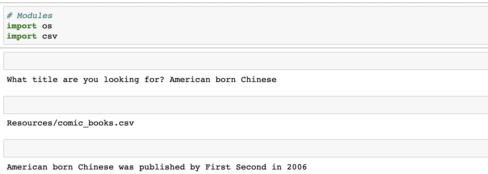

* Send out the following files and instructions:

* **Files:**

  * [comicbooks.py](Activities/02-Stu_ComicsRemix-Jupyter/Unsolved/comicbooks.py)

  * [comic_books.csv](Activities/02-Stu_ComicsRemix-Jupyter/Unsolved/Resources/comic_books.csv)

* **Instructions:**

  * Using `comicbooks.py` as a starting point, convert the application so that it runs properly within a Jupyter Notebook.

  * Have the application print out the user's input, the path to `comic_books.csv`, and the publisher/date published for the book in different cells.

* **Bonus:**

  * Go through any of the activities from last week, and attempt to convert them to run within a Jupyter Notebook. As you go, try to split up the code into cells and print out the outputs.

</details>

<details>
    <summary><strong>⭐ 1.4 Review: Comic Book Remix (0:05)</strong></summary>

* You may choose to use the slideshow as you go through the code.

* Open and share the file [02-ComicsRemix](Activities/02-Stu_ComicsRemix-Jupyter/Solved/ComicsRemix.ipynb), then go through the code with the class, answering any questions that students may have.

* Cover the following key points as you review the activity:

  * We can run the code within a cell by placing the cursor inside of the cell and pressing **Shift + Enter**.

  * If the code within a cell is not run, then any changes made within will not be saved into memory.

  * The code contained in a Jupyter notebook is not linear. For example, if two cells modify the same variable, then the block of code that was run most recently will determine the value of the variable.

  * The following screenshot captures the code and results of the Jupyter Notebook file:

  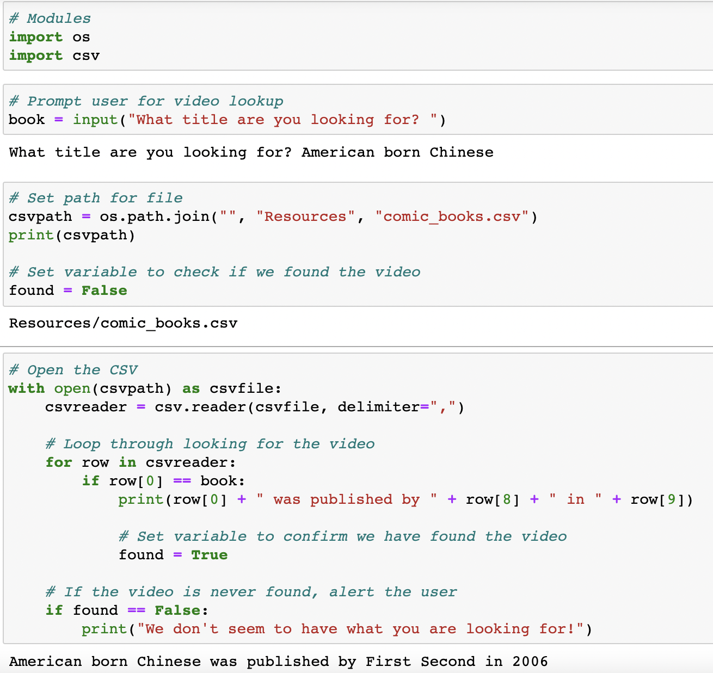

* Data Source: Data modified from "Comic books CSV" Updated April 2021. Initially released in 2014 to accompany the British Library's exhibition Comics Unmasked. [https://www.bl.uk/collection-metadata/downloads](https://www.bl.uk/collection-metadata/downloads)

</details>

- - -

## 2. Introduction to Pandas and DataFrame Shop

| Activity Time:       0:30 |  Elapsed Time:      1:05  |
|---------------------------|---------------------------|

<details>
    <summary><strong>📣 2.1 Instructor Do: Introduction to Pandas (0:05)</strong></summary>

* Continue using the slideshow to cover the talking points for this section:

* Jupyter Notebook’s code testing and visualisation capabilities really start to shine through when these principles are applied to large tables. However, as the students have likely realised, it can be very stressful to modify huge datasets using pure Python.

  * Thankfully, the Pandas library is extraordinarily powerful when it comes to visualising, analysing, and altering large datasets.

* Although Python is stuck using lists, tuples, and dictionaries, Pandas lets Python programmers work with **Series** and **DataFrames**.

  * These two data types, unique to Pandas, are essentially structured lists with many built-in convenience methods that allow for quick and easy data manipulation.

  * A Pandas Series is a one-dimensional labeled array capable of holding any data type. This means that, like an array, the data is linear, and like a dictionary, it has an index that acts as a key. This is shown in the following image:

  

  * A Pandas DataFrame is a two-dimensional labeled data structure with columns of potentially different data types. We can think of a DataFrame as an Excel spreadsheet where each column is a Series, as in the following image:

  

</details>

<details>
    <summary><strong>📣 2.2 Instructor Do: Creating Pandas DataFrames (0:05)</strong></summary>

* Continue using the slideshow as you begin to discuss the next activity.

* Open [03-IntroToPandas](Activities/03-Ins_IntroToPandas/Solved/creating_data_frames.ipynb) within Jupyter Notebook, send the file students, and demonstrate to the class what Pandas Series and DataFrames are and how to create them. Cover the following key points:

  * First, the Pandas library is imported using `import pandas as pd`. This method of import allows Pandas functions/methods to be called using the variable `pd`.

  * To create a Series, simply use the `pd.Series()` function and place a list within the parentheses. The index for the values in the Series will be the numeric index of the initial list, as captured in the following image:

  

  * There’s more than one way to create DataFrames from scratch. One way is to use the `pd.DataFrame()` function and provide it with a list of dictionaries. Each dictionary will represent a new row where the keys become column headers and the values are placed inside the table.

  * Another way to use the `pd.DataFrame()` function is to provide it with a dictionary of lists. The keys of the dictionary will be the column headers, and the listed values will be placed into their respective rows.

  * The following image captures these two ways to create DataFrames:

  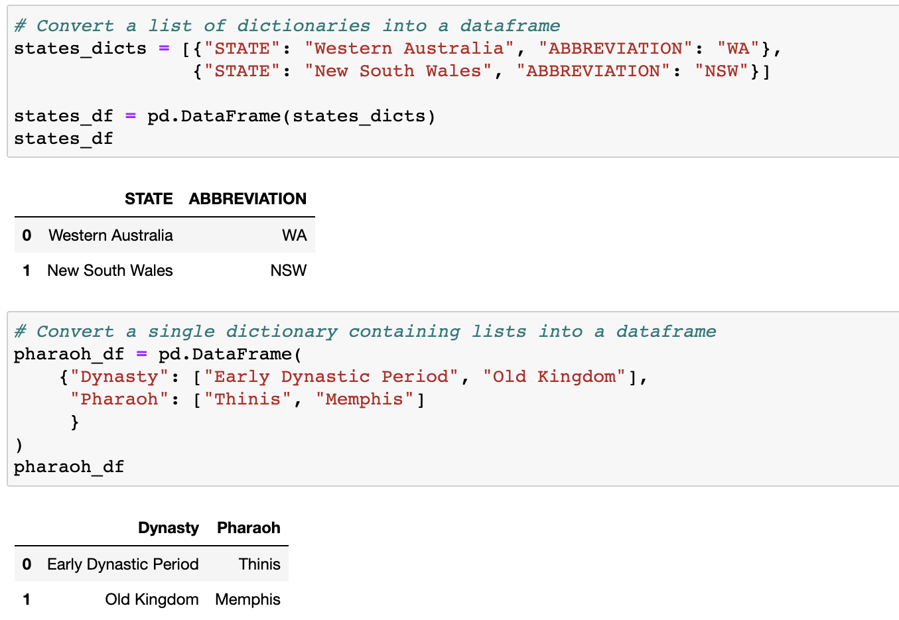

</details>

<details>
    <summary><strong>✏️ 2.3 Students Do: DataFrame Shop (0:15)</strong></summary>

* Continue the slideshow to introduce this activity to the class.

* Students will now try to create DataFrames from scratch using the two methods we just discussed. This activity will also give them the opportunity to better understand DataFrame structure.

* Open [04-Stu_DataFrameShop](Activities/04-Stu_DataFrameShop-Pandas/Unsolved/DataFrameShop.ipynb) within the Jupyter notebook, and explain the end results of the application, which are captured in the following image:


 * Send out the following file and instructions:

* **File:**

  * [04-Stu_DataFrameShop](Activities/04-Stu_DataFrameShop-Pandas/Unsolved/DataFrameShop.ipynb)

* **Instructions:**

  * Create a DataFrame for a frame shop. The DataFrame should contain three columns, "Frame", "Price", and "Sales", and have five rows of data stored within it.

  * Using an alternative method, create a DataFrame for an art gallery. The DataFrame should contain three columns, "Painting", "Price", and "Popularity", and have four rows of data stored within it.

* **Bonus:**

  * Once both DataFrames have been created, consider the benefits and drawbacks of each method. Try to imagine situations where each method is preferable to the other.

</details>

<details>
    <summary><strong>⭐ 2.4 Review: DataFrame Shop (0:05)</strong></summary>

* Continue using the slideshow to facilitate a review of the activity.

* Open [04-Stu_DataFrameShop](Activities/04-Stu_DataFrameShop-Pandas/Solved/DataFrameShop.ipynb), send the file to the students, and go through the code with the class, answering any questions that students may have.

* Cover the following key points in your review of this activity:

  * It is important to save the created DataFrames to a variable; otherwise, they will only be printed to the screen, and they will not be available for use later.

  * Although the list-of-dictionaries method of DataFrame creation is viable, it takes longer to write the code because the keys have to be rewritten each time. However, it does allow the programmer to better understand each row in their DataFrame.

  * The dictionary-of-lists method is more time-effective because the keys only need to be written once. The DataFrame can be harder to read through, however, as if even one of the lists contains fewer values than the others, then an error will be returned.

  * The following image captures the creation of the frame shop DataFrame, using the list-of-dictionaries method, and the creation of the art gallery DataFrame, using the dictionary-of-lists method:


</details>

- - -

## 3. Training Grounds

| Activity Time:       0:25 |  Elapsed Time:      1:30  |
|---------------------------|---------------------------|

<details>
    <summary><strong>📣 3.1 Instructor Do: DataFrame Functions (0:05)</strong></summary>

* Continue using the slideshow to cover the following talking points:

* Table visualisation is not the only benefit of using Pandas DataFrames. Many of the functions/methods that come packaged with Pandas allow for quick and easy analysis of large datasets.

* Open [05-Ins_DataFunctions](Activities/05-Ins_DataFunctions/Solved/data_functions.ipynb) within Jupyter Notebook, share the file with the students, and make sure to point out how an external CSV file is being imported. Students will learn how to do this later in today's lesson.

  * The first method to describe is `head()`, which takes a DataFrame and presents only the first five rows of data inside of it. This number can be increased or decreased by placing an integer within the parentheses.

  * The `head()` method is helpful because it allows the programmer to check a minified version of a larger table; then, they can make informed changes without searching through the entire dataset.

  * Another useful method is `describe()`, which will print out a DataFrame containing some analysis of the table and its columns. It also indicates some of the other data functions that can be performed on a DataFrame or Series, such as `count()`, `mean()`, `std()`, `min()`, and `max()`. This is captured in the following image:

  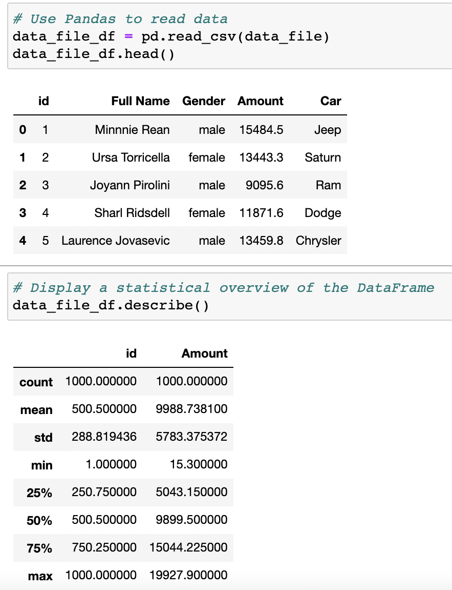

  * Most data functions can also be performed on a Series by referencing a single column within the whole DataFrame. Similar to referencing a key within a dictionary, we’d take the DataFrame and follow it up with brackets containing the desired column's header.

  * Multiple columns can be referenced, as well, by placing all of the column headers desired within a pair of double brackets. If two sets of brackets are not used, then Pandas will return an error.

  * The following image captures three examples of how specific columns can be referenced and used.

  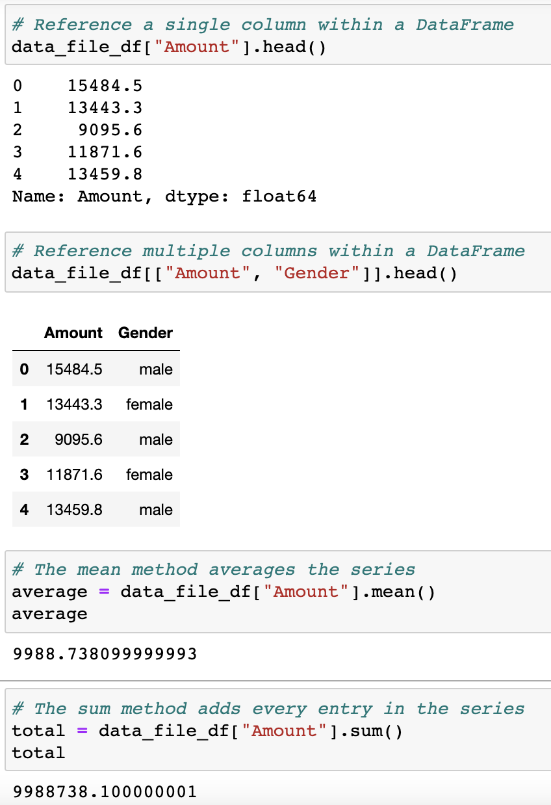

  * In some situations, it is helpful to list out all of the unique values stored within a column. This is precisely what the `unique()` function does: it looks into a Series and returns all the different values contained within, as captured in the following image:

  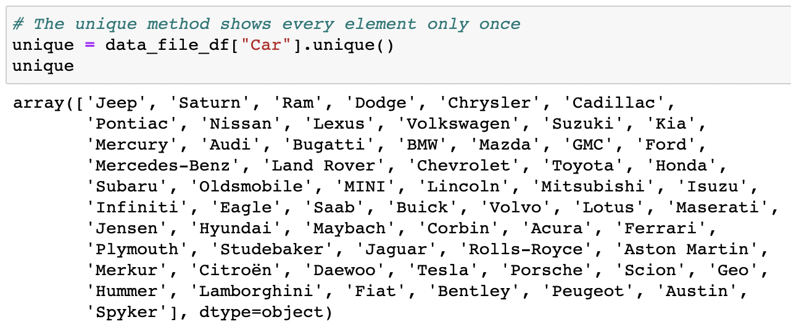

  * Another method with similar functionality is `value_counts()`, which not only returns a list of all unique values within a series but also counts how many times a value appears, as captured in the following image:

  

  * Calculations can also be performed on columns and then added into the DataFrame as a new column by referencing the DataFrame, placing the desired column header within brackets, and then setting it equal to a Series, as captured in the following image:

  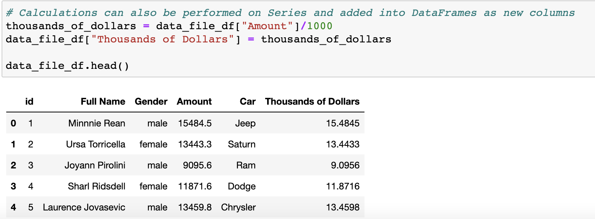

* Data Source: Data generated by Mockaroo, LLC. (2021) Realistic Data Generator. [https://www.mockaroo.com/](https://mockaroo.com/). Data for this dataset was generated by edX Boot Camps LLC, and is intended for educational purposes only.

</details>

<details>
    <summary><strong>✏️ 3.2 Students Do: Training Grounds (0:15)</strong></summary>

* Continue through the slideshow, using the next slides as an accompaniment to this activity.

* Students will now take a large DataFrame containing 200 rows, analyse it with data functions, and then add a new column into it.

* Open up [06-Stu_TrainingGrounds](Activities/06-Stu_TrainingGrounds-DataFunctions/Solved/TrainingGrounds.ipynb) within the Jupyter Notebook, and run and discuss the code to give the students an idea of the application’s end results, as captured in the following image:


* Send out the following file and instructions:

* **File:**

  * [TrainingGrounds.ipynb](Activities/06-Stu_TrainingGrounds-DataFunctions/Unsolved/TrainingGrounds.ipynb)

* **Instructions:**

Using the DataFrame provided, perform all of the following actions:

* Provide a simple analytical overview of the dataset's numeric columns.

* Collect all of the names of the trainers within the dataset.

* Figure out how many students each trainer has.

* Find the average weight of the students at the gym.

* Find the combined weight of all of the students at the gym.

* Convert the "Membership (Days)" column into weeks, and then add this new Series into the DataFrame.

</details>

<details>
    <summary><strong>⭐ 3.3 Review: Training Grounds (0:05)</strong></summary>

* Continue using the slideshow to facilitate a review of the activity.

* Open and share [06-Stu_TrainingGrounds](Activities/06-Stu_TrainingGrounds-DataFunctions/Solved/TrainingGrounds.ipynb), and go through the code with the class, answering any questions that students may have.

* Cover the following key points when discussing this activity:

  * By collecting the unique values for the "Trainer" column, it’s much easier to identify the employees who are currently with the "Training Grounds" gym.

  * To convert "Membership (Days)" into "Membership (Weeks)", the code simply takes the values stored within the initial column, divides them by seven, and then adds this edited Series into a newly created column, as captured in the following image:

  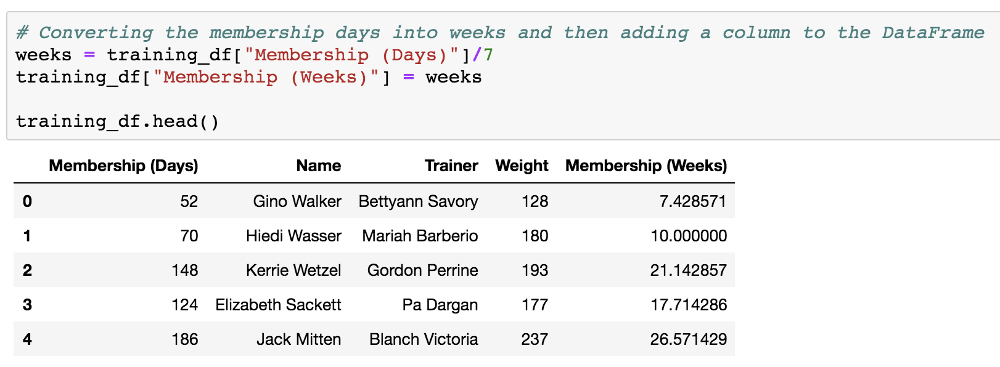

</details>

- - -

## 4. Hey, Arnold!

| Activity Time:       0:20 |  Elapsed Time:      1:50  |
|---------------------------|---------------------------|

<details>
    <summary><strong>📣 4.1 Instructor Do: Modifying Columns (0:05)</strong></summary>

* Continue using the slideshow to cover the following talking points:

* As the class discovered in the previous activity, columns within a DataFrame are not always placed in the desired position by default. Sometimes they may not even have a descriptive or concise-enough name.

  * Thankfully, it’s very easy to modify the name or placement of a column with the `rename()` function and the use of double brackets.

* Now, open [07-Ins_ColumnManipulation](Activities/07-Ins_ColumnManipulation/Solved/ColumnManipulation.ipynb) within Jupyter Notebook, and go through the code with the class.

  * To collect a list of all the columns contained within a DataFrame, simply use the `df.columns` call, and an object containing the column headers will be printed to the screen.

  * To reorder the columns, create a reference to the DataFrame followed by two brackets with the column headers placed in the desired order.

  * It is also possible to remove columns by simply not creating a reference to them. This will, in essence, drop them from the newly made DataFrame.

  * To rename the columns within a DataFrame, use the `df.rename()` method and place `columns={}` within the parentheses. Inside the dictionary, the keys should be references to the current columns, and the values should be the desired column names.

  * The following image captures how to create a list with the names of a DataFrame’s columns, reorganise the column order in a DataFrame, and rename the columns of a DataFrame:

  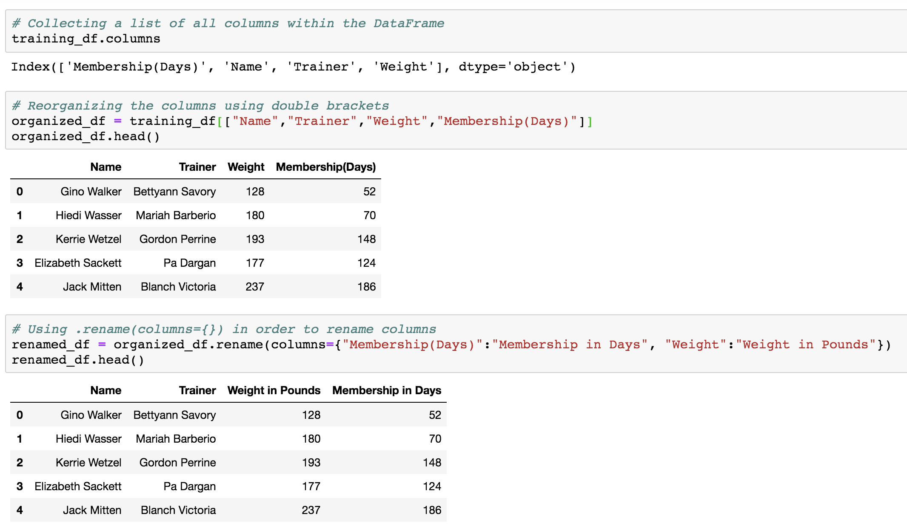

</details>

<details>
    <summary><strong>✏️ 4.2 Students Do: Hey Arnold! (0:10)</strong></summary>

* Continue through the slideshow, using the next slides as an accompaniment to this activity.

* Now, the students will take a premade DataFrame of "Hey Arnold!" characters and reorganise it so it is easier to understand.

* Open [08-Stu_Hey_Arnold](Activities/08-Stu_Hey_Arnold-DataFrame-Formatting/Solved/hey_arnold.ipynb) within the Jupyter Notebook, and run and discuss the code to give students an idea of the application’s end results. The following image captures the DataFrame in the starter file:

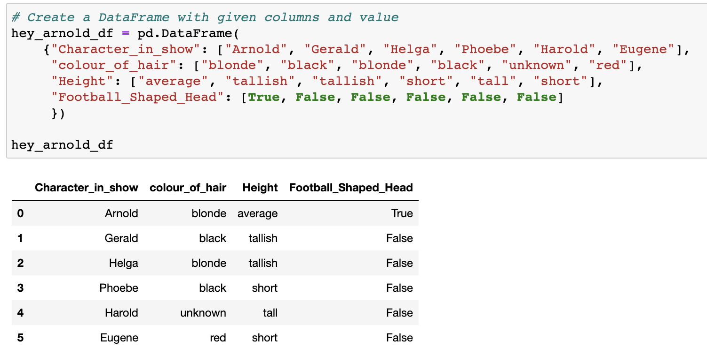

* Send out the following file and instructions:

* **File:**

  * [hey_arnold.ipynb](Activities/08-Stu_Hey_Arnold-DataFrame-Formatting/Unsolved/hey_arnold.ipynb)

* **Instructions:**

* First, use Pandas to create a DataFrame with the following columns and values:

  * `Character_in_show`: Arnold, Gerald, Helga, Phoebe, Harold, Eugene

  * `colour_of_hair`: blonde, black, blonde, black, unknown, red

  * `Height`: average, tallish, tallish, short, tall, short

  * `Football_Shaped_Head`: True, False, False, False, False, False

* Note that the column names are inconsistent and difficult to work with. Rename them to the following, respectively:

  * `Character`, `Hair Color`, `Height`, `Football Head`

* Next, create a new table that contains all of the columns in the following order:

  * `Character`, `Football Head`, `Hair Colour`, `Height`

</details>

<details>
    <summary><strong>⭐ 4.3 Review: Hey Arnold! (0:05)</strong></summary>

* Continue using the slideshow to facilitate a review of the activity.

* Open [08-Stu_Hey_Arnold](Activities/08-Stu_Hey_Arnold-DataFrame-Formatting/Solved/hey_arnold.ipynb), and go through the code with the class, answering any questions that students may have.

* Cover the following key points when discussing this activity:

  * First, we take the currently named columns, convert them into the more readable versions using `hey_arnold.rename(columns={})`, and apply the changes to a new variable.

  * Then, using double brackets, the new columns are reorganised and placed into another new variable, which now holds the fully formatted DataFrame.

  * The following image captures how to rename and reorganise the DataFrame columns for this activity:

  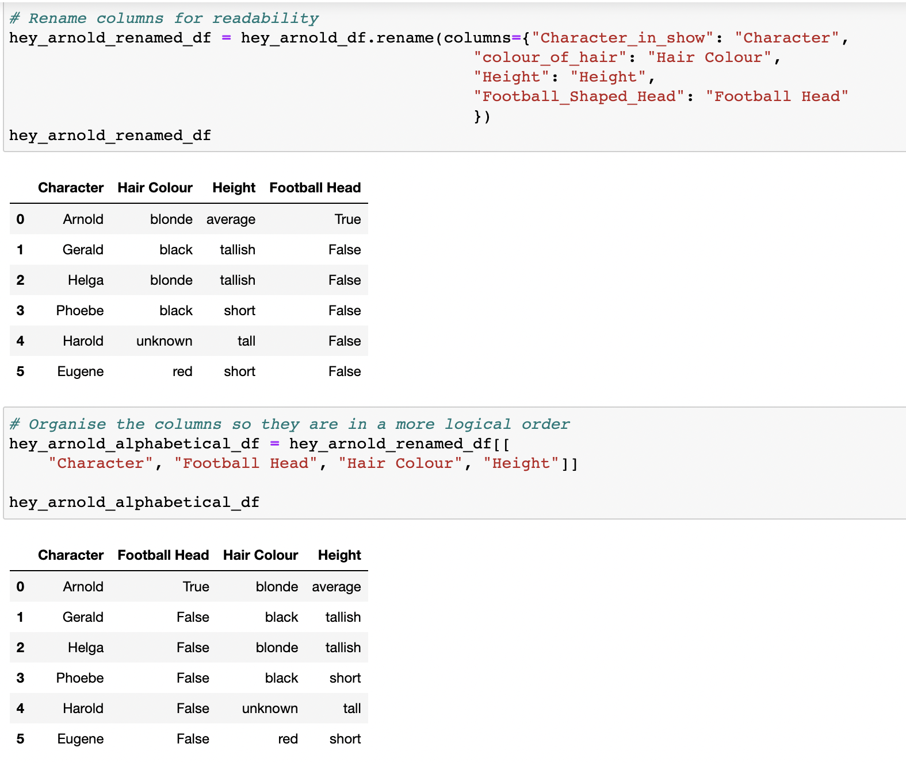

</details>

- - -

## Break

| Activity Time:       0:15 |  Elapsed Time:      2:05  |
|---------------------------|---------------------------|


- - -

## 5. Comic Books - Reading and Writing CSVs

| Activity Time:       0:55 |  Elapsed Time:      3:00  |
|---------------------------|---------------------------|

<details>
    <summary><strong>📣 5.1 Instructor Do: Reading and Writing CSV Files (0:05)</strong></summary>

* Continue using the slideshow to cover the following talking points:

* Up to this point, the class has manually created DataFrames using the `pd.DataFrame()` method. Now, they’ll learn a much more effective way to create large DataFrames: importing CSV files.

* Open [09-Ins_ReadingWritingCSV](Activities/09-Ins_ReadingWritingCSV/Solved/pandas_reading_files.ipynb) within Jupyter Notebook, and go through the code with the class.

  * Create a reference to the CSV file's path, and pass it into the `pd.read_csv()` method. Make sure that you store the returned DataFrame in a variable. From then on, the DataFrame can be altered and manipulated like any other Pandas DataFrame.

  * In most cases, it is not important to use or define the encoding of the base CSV file; however, if the encoding is different than UTF-8, then it may become necessary so that the CSV is translated correctly.

  * The following image captures the code in Jupyter Notebook for how to read a CSV file with ISO-8859-1 encoding into Pandas and then display the head of its contents.

  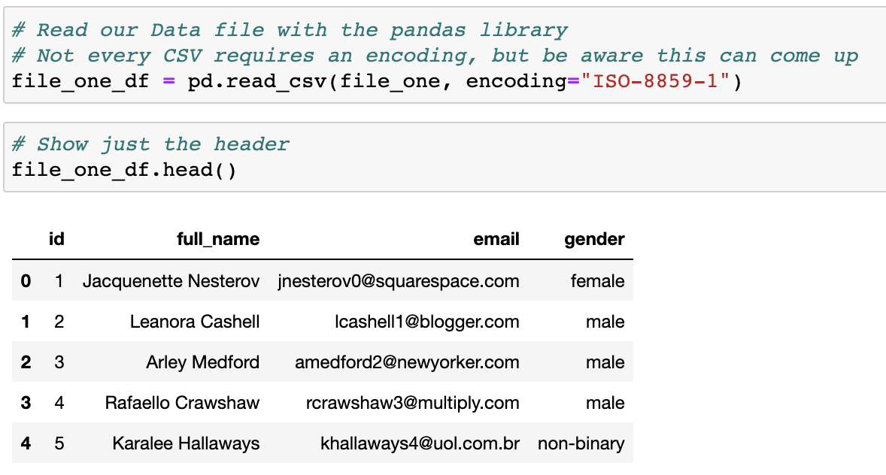

  * It is just as easy to write to a CSV file as it is to read from one. Simply use the `df.to_csv()` method, and pass the path to the desired output file. By using the `index` and `header` parameters, programmers can also manipulate whether they would like the index or header for the table to be passed as well, as captured in the following image:

  

  * Pandas can only write to a new CSV file in directories that already exist. If the path to the output file contains a directory that doesn’t exist, Pandas will return a `FileNotFoundError`.

* Data Source: Data generated by Mockaroo, LLC. (2021) Realistic Data Generator. [https://www.mockaroo.com/](https://mockaroo.com/). Data for this dataset was generated by edX Boot Camps LLC, and is intended for educational purposes only.

</details>

<details>
    <summary><strong>✏️ 5.2 Students Do: Comic Books Part 1 (0:20)</strong></summary>

* Continue through the slideshow, using the next slides as an accompaniment to this activity.

* The students will now take a large CSV file containing comic books, read it into Jupyter Notebook using Pandas, clean up the columns, and then write their modified DataFrame to a new CSV file.

* Open the unmodified [10-Stu_ComicBooksCSV/Resources/comic_books_expanded.csv](Activities/10-Stu_ComicBooksCSV/Unsolved/Resources/comic_books_expanded.csv) to introduce students to what they will be working with; then, open and discuss [10-Stu_ComicBooksCSV/Solved/Output/books_clean.csv](Activities/10-Stu_ComicBooksCSV/Solved/Output/books_clean.csv) to give students an idea of the finished product. The following image captures the final outputs in the notebook:

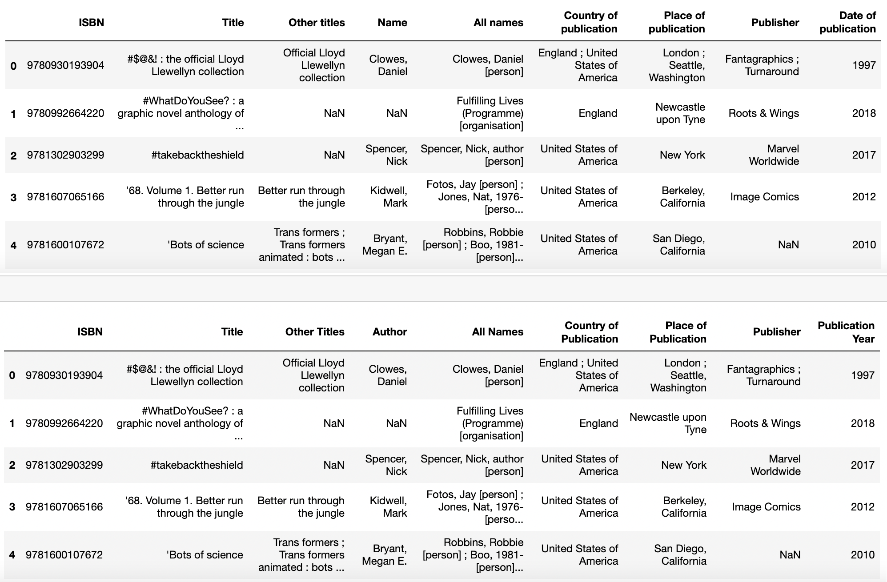

* Then, send out the following files and instructions:

* **Files:**

  * [ComicBooks.ipynb](Activities/10-Stu_ComicBooksCSV/Unsolved/ComicBooks.ipynb)

  * [comic_books_expanded.csv](Activities/10-Stu_ComicBooksCSV/Unsolved/Resources/comic_books_expanded.csv)

* **Instructions:**

  * Read in the comic books CSV using Pandas.

  * Remove unnecessary columns from the DataFrame so that only the following columns remain: `ISBN`, `Title`, `Other titles`, `Name`, `All names`, `Country of publication`, `Place of publication`, `Publisher`, `Date of publication`.

  * Rename the `Name` column to `Author`, rename the `Date of publication` column to `Publication Year`, and then capitalise the remaining columns by using title case capitalisation.

  * Write the DataFrame into a new CSV file.

* **Hint:**

  * The base CSV file uses UTF-8 encoding. Trying to read in the file using another kind of encoding could introduce strange characters to the dataset. Check the tail of the dataset with `.tail()` to determine if you correctly imported the CSV file. You should be able to find characters from other languages.

</details>

<details>
    <summary><strong>⭐ 5.3 Review: Comic Books Part 1 (0:05)</strong></summary>

* Continue using the slideshow to facilitate a review of the activity.

* Open [10-Stu_ComicBooks](Activities/10-Stu_ComicBooksCSV/Solved/ComicBooks.ipynb), send the file to students, and go through the code with the class, answering any questions that students may have.

* Cover the following key points when discussing this activity:

  * The initial CSV file is encoded using UTF-8, so it should also be read in using this encoding to ensure that there are no strange characters hidden within the dataset. `.tail()` can be used to view some of these special characters at the end of this DataFrame, as captured in the following image:

  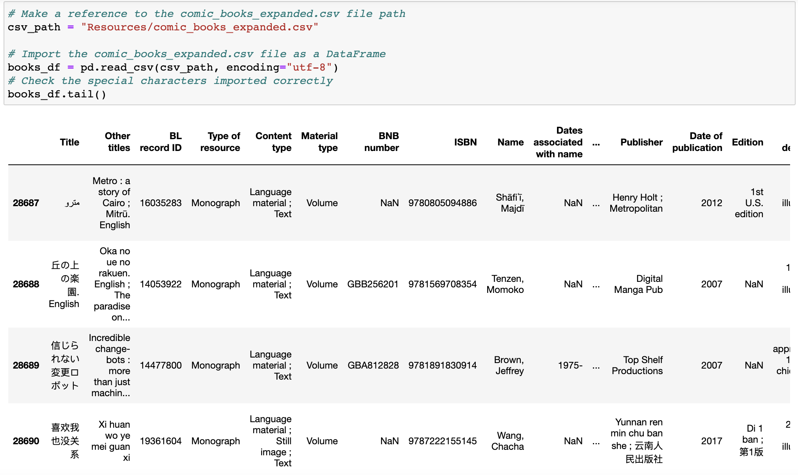

  * Many columns are being modified within this code. To avoid potential errors, it is essential to make sure that all references are made accurately.

  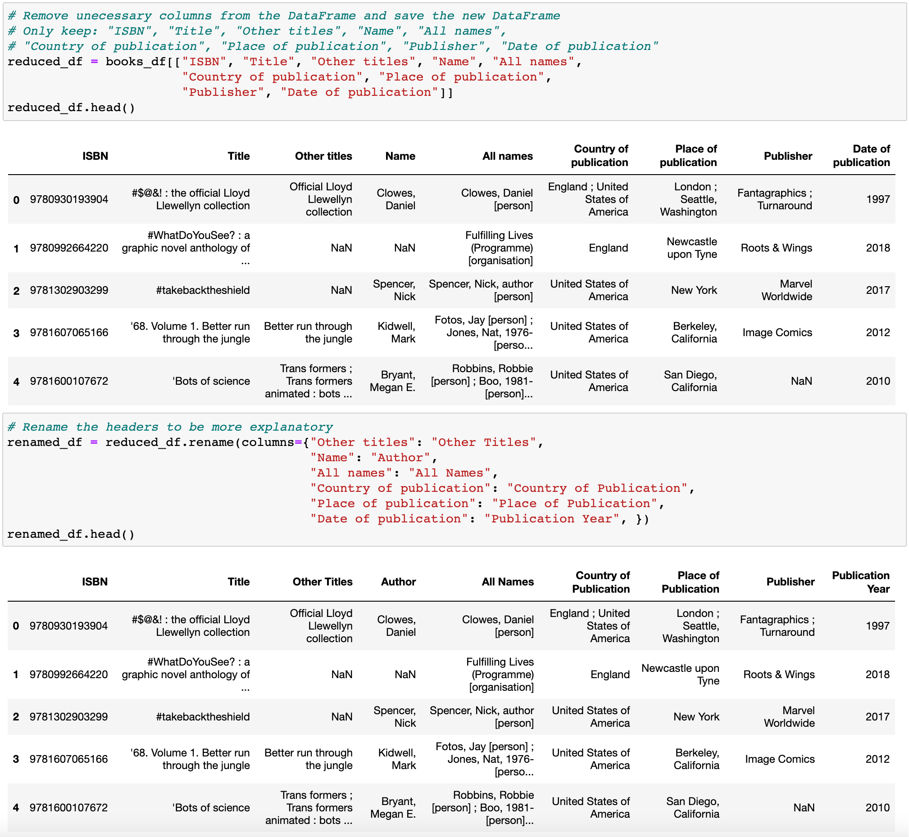

  * The path to the output CSV must point to an already-existing CSV, as in the following image; otherwise, an error will be returned. The encoding for the output CSV should also be set as UTF-8 so those strange symbols from earlier do not reappear, as demonstrated with the following code:

  ```python
  # Push the remade DataFrame to a new CSV file
  renamed_df.to_csv("Output/books_clean.csv",
                  encoding="utf-8", index=False, header=True)
  ```

* Data Source: Data modified from "Comic books CSV" Updated April 2021. Initially released in 2014 to accompany the British Library's exhibition Comics Unmasked. [https://www.bl.uk/collection-metadata/downloads](https://www.bl.uk/collection-metadata/downloads)

  </details>

<details>
    <summary><strong>✏️ 5.4 Students Do: Comic Books Part 2 (0:20)</strong></summary>

* Students will now take the modified version of the comic book DataFrame and create a new summary DataFrame based on that dataset, using some of Pandas' built-in data functions.

* Return to the slideshow to introduce the activity and read the instructions to the students.

* Open [11-Stu_ComicBooksSummary](Activities/11-Stu_ComicBooksSummary/Solved/ComicBooksSummary.ipynb) within the Jupyter Notebook, and run and discuss the code to give students an idea of the application’s end results, as captured in the following image:


* Send out the following files and instructions:

* **Files:**

  * [ComicBooksSummary.ipynb](Activities/11-Stu_ComicBooksSummary/Unsolved/ComicBooksSummary.ipynb)

  * [books_clean.csv](Activities/11-Stu_ComicBooksSummary/Unsolved/Resources/books_clean.csv)

* **Instructions:**

  * Using the modified DataFrame that was created earlier, create a summary table for the dataset, including the following pieces of information:

    * The count of unique authors within the DataFrame

    * The count of unique countries of publication within the DataFrame

    * The year of the earliest published book in the DataFrame

    * The year of the latest published book in the DataFrame

</details>

<details>
    <summary><strong>⭐ 5.5 Review: Comic Books Part 2 (0:05)</strong></summary>

* Continue using the slideshow to facilitate a review of the activity.

* Open [11-Stu_ComicBooksSummary](Activities/11-Stu_ComicBooksSummary/Solved/ComicBooksSummary.ipynb), and go through the code with the class, answering any questions that students may have.

* Cover the following key points when reviewing this activity:

  * The count of unique authors can be found by using `len(comics_df["Author"].unique())`, which looks into the list of authors, places all of the unique values into a list, and then finds the list's length.

  * To find the earliest year, use the `min()` method on the "Publication Year" column.

  * To find the latest year, use the `max()` method on the "Publication Year" column.

  * To add these values into the summary DataFrame, the values must be placed within brackets. Otherwise, Pandas will return an error.

  * The following image captures the code for this activity:

  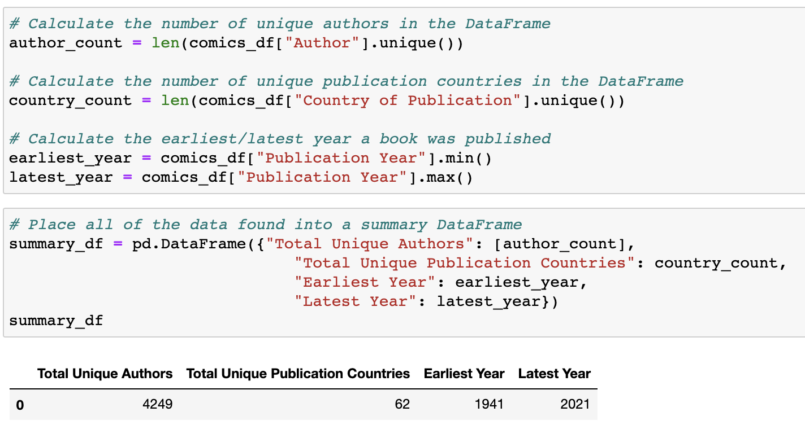

* Data Source: Data modified from "Comic books CSV" Updated April 2021. Initially released in 2014 to accompany the British Library's exhibition Comics Unmasked. [https://www.bl.uk/collection-metadata/downloads](https://www.bl.uk/collection-metadata/downloads)

</details>

- - -

© 2022 edX Boot Camps LLC. Confidential and Proprietary. All Rights Reserved.
